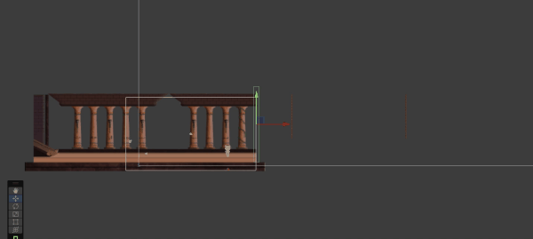

# FrameSwitch Script for Unity 🎮

This Unity C# script enables smooth transitions between 2D frame-based levels or rooms, ideal for side-scrolling or puzzle adventure games.
## 🎥 Demo

## ✨ Features
- Automatically enables/disables GameObjects that represent different "frames" or rooms.
- Teleports the player to the correct spawn point when transitioning between frames.
- Supports forward and backward transitions.
- Prevents duplicate transitions using a cooldown flag.
- Integrates with Cinemachine (optional).

## 🧠 How It Works
Attach this script to a trigger zone (e.g. an empty GameObject with a `BoxCollider2D` set as a trigger). When the player enters the trigger, the script:
- Checks if they’re moving forward or backward.
- Teleports them to a defined spawn point (or keeps their position if none set).
- Disables the current frame and enables the target frame.

## 🧰 Usage

1. **Setup Your Scene:**
   - Create two frames/rooms as GameObjects in your scene (e.g., `Frame1`, `Frame2`).
   - Add this script to a trigger object between them.

2. **Assign in Inspector:**
   - `frameBack`: The previous frame (e.g. `Frame1`)
   - `frameForward`: The next frame (e.g. `Frame2`)
   - `player`: The player GameObject
   - `frameForwardSpawnPoint`: Where the player appears when entering the next frame
   - `frameBackSpawnPoint`: Where the player appears when going back

3. **Tag Your Player:**
   Make sure your player is tagged `"Player"` for the script to detect collisions.

4. **Optional:**
   If you're using **Cinemachine**, the script auto-detects the active virtual camera on scene start.

## 🧩 Requirements
- Unity 2020 or newer
- 2D Toolkit (Rigidbody2D, Collider2D)
- (Optional) Cinemachine package

## 🔐 License
This script is open-source under the MIT License — free to use in commercial and personal projects.

---

Made for [Cat of Egypt 🐾](https://github.com/Phloxxl)  
